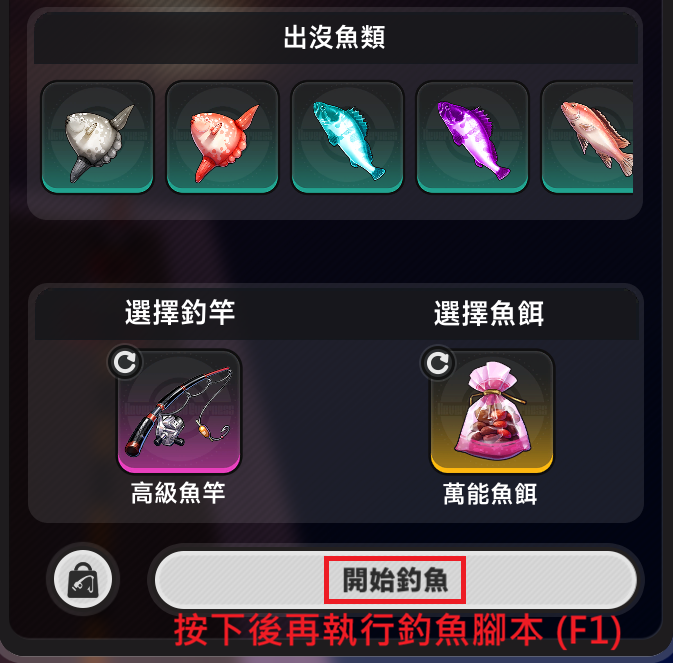

# NTE 自動化平台

**[⬇️ 點擊可直接下載](https://github.com/asd880921/nte-platform/releases/latest/download/NTE-Platform.zip)**

異環（NTE / Neverness to Everness）遊戲腳本的**整合平台**。把多支自動化腳本收在同一個桌面介面裡，一鍵啟動、一鍵停止，幫你處理遊戲中重複性的操作。

**不需要安裝 Python**，下載解壓後雙擊就能用。

---

## 特色

- **一站式整合**：所有腳本集中管理，一個介面即可啟動、停止與查看執行狀態。
- **即時執行紀錄**：內建主控台，腳本執行流程與錯誤訊息一目了然。
- **免安裝 Python**：下載 Release、解壓縮後即可使用，不需安裝任何開發環境。
- **遊戲視窗辨識**：僅針對遊戲視窗進行畫面辨識，不受其他桌面視窗影響。

---

## 開始使用

1. 下載 zip 並**解壓縮**（請先解壓再執行，不要直接在壓縮檔裡開）。
2. 進資料夾雙擊 **`NTE-Platform.exe`**。
3. 把遊戲**解析度設為 1920 × 1080**。
4. 在面板上選要跑的腳本，按「**啟動**」。

> 詳細的腳本操作資訊，可接續 **`下方章節`** 繼續閱讀。

---

## 腳本說明

<table>
<thead>
<tr>
<th nowrap>腳本</th>
<th nowrap>支援模式</th>
<th>說明</th>
</tr>
</thead>
<tbody>
<tr>
<td nowrap>1-1 店長精選 (安魂曲)</td>
<td nowrap>⚪ 前台</td>
<td>請先進入店長精選畫面，選擇「1-1」章節後，再按 <code>F1</code> 啟動。</td>
</tr>
<tr>
<td nowrap>自動釣魚</td>
<td nowrap>⚪ 前台 🟠 後台</td>
<td>請先進入釣魚畫面按下「開始釣魚」後，再按 <code>F1</code> 啟動腳本。</td>
</tr>
</tbody>
</table>

### 執行模式

執行模式決定腳本如何將鍵盤與滑鼠操作傳送至遊戲。

<table>
<thead>
<tr>
<th nowrap>模式</th>
<th>說明</th>
<th>限制</th>
</tr>
</thead>
<tbody>
<tr>
<td nowrap>⚪ 前台</td>
<td>使用全域鍵盤 / 滑鼠輸入，等同玩家實際操作，輸入會送至目前最上層視窗。</td>
<td>遊戲需保持在最上層，執行期間避免操作鍵盤滑鼠。</td>
</tr>
<tr>
<td nowrap>🟠 後台</td>
<td>使用 Windows 視窗訊息（<code>WM_KEYDOWN</code> / <code>WM_KEYUP</code>）直接傳送按鍵至遊戲視窗，並告知該視窗為作用中，不佔用實體輸入。</td>
<td>遊戲不可最小化，但可以被其他視窗覆蓋。</td>
</tr>
</tbody>
</table>

### 模式切換

- 同時支援前台與後台的腳本，啟動前可於卡片內選擇執行模式。
- 執行期間無法切換模式，需停止腳本後重新設定。
- 已選擇過的模式會自動記憶，下次啟動時沿用。
- 僅支援單一模式的腳本，會直接顯示固定模式標籤。

> 前台與後台皆屬第三方自動化工具，差異僅在輸入方式。請參考文末免責說明，自行評估使用方式。

---

#### 🍅 1-1 店長精選啟動方式
1. 在「**店長精選**」視窗，選取「**1-1**」章節 (不需要點選 「**開始營業**」 按鈕)。
2. 按下 `F1` 啟動腳本。

#### 🎣 自動釣魚啟動方式

1. 在「**釣魚準備**」視窗按下 **開始釣魚**。
2. 進入釣魚畫面後，再按 `F1` 啟動腳本。
3. 第一次拋竿會由腳本自動完成，不需要手動操作。

---

## 更新提示

程式開啟時會向 GitHub 查一次最新版本；有新版時**工具列會出現 🟠「新版 vX.Y.Z」**，點擊即開啟下載頁（About 視窗也會提示）。只讀取版本資訊，不會上傳任何資料。

更新方式：

1. 下載最新的 `NTE-Platform.zip`
2. 解壓縮後**整包覆蓋**原本的資料夾
3. 重新開啟 `NTE-Platform.exe`

> ⚠️ 若你替換過 `scripts\<腳本名稱>\template\` 裡的辨識圖，覆蓋會蓋掉你的版本，請先自行備份。

---

## 疑難排解

**主控台顯示「找不到 NTE 視窗」**  
確認遊戲已經開啟並在執行中，再重按一次啟動。

**腳本卡在「等待…」不動，或動作點錯位置**  
九成是**解析度或 HDR 設定不符**，請先確認：
- 遊戲解析度為 **1920 × 1080**
- **Windows HDR 已關閉**

若以上設定都沒問題，代表辨識用的圖片跟你的畫面對不上：打開 `scripts\<腳本名稱>\template\`，用你自己的遊戲畫面重新截一張同樣的圖，以**相同檔名**覆蓋存檔，再重新啟動即可。

**按了啟動但遊戲沒反應**  
⚪ 前台模式的按鍵是送給**最上層視窗**，請確認按 `F1` 前已切回遊戲畫面。

**🟠 後台模式沒反應，或畫面一直「等待…」**  
- 確認遊戲視窗**沒有被最小化**（最小化就讀不到畫面；被其他視窗蓋住沒關係）。腳本偵測到最小化會暫停並在主控台提示，還原後自動繼續。
- 若視窗正常但按鍵完全沒進遊戲，改用 ⚪ **前台**模式跑即可。

**介面打不開 / 一片空白**  
平台介面需要 Microsoft Edge **WebView2 Runtime**（Windows 10 / 11 通常已內建），若沒有請至微軟官網安裝後再重新開啟。

---

## 安全性 / 免責說明

本工具採用**侵入性最低**的自動化方式，運作原理單純：

- ✅ 只做兩件事：**截取遊戲視窗畫面**做影像辨識、**模擬鍵盤/滑鼠**操作（等同真人操作）。
- ❌ **不**讀寫遊戲記憶體、**不**修改任何遊戲檔案、**不**攔截或竄改網路封包、**不**注入遊戲程序。

因此相較於修改器 / 記憶體外掛，這是風險相對低的一類做法。

不過它仍屬**第三方自動化工具**，是否符合規範由遊戲官方條款認定，本專案無法保證絕對不會被偵測或處分。**請自行斟酌使用**。
