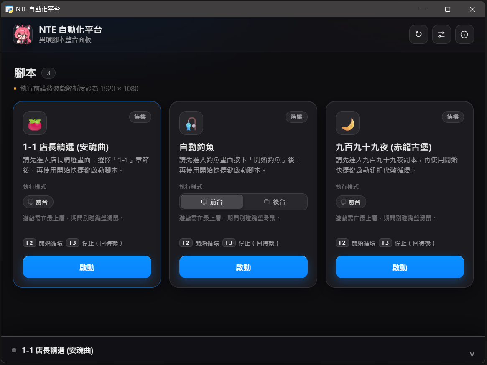

# NTE 自動化平台

**[⬇️ 點擊下載 (為 Github Release 最新版)](https://github.com/asd880921/nte-platform/releases/latest/download/NTE-Platform.zip)**

異環（NTE / Neverness to Everness）遊戲腳本的**整合平台**。把多支自動化腳本收在同一個桌面介面裡，一鍵啟動、一鍵停止，幫你處理遊戲中重複性的操作。

**不需要安裝 Python**，下載解壓後雙擊就能用。

---

## 特色

- **一站式整合**：所有腳本集中管理，一個介面即可啟動、停止與查看執行狀態。
- **即時執行紀錄**：內建主控台，腳本執行流程與錯誤訊息一目了然。
- **免安裝 Python**：下載 Release、解壓縮後即可使用，不需安裝任何開發環境。
- **遊戲視窗辨識**：僅針對遊戲視窗進行畫面辨識，不受其他桌面視窗影響。

---

## 開始使用

1. 下載 zip 並**解壓縮**（請先解壓再執行，不要直接在壓縮檔裡開）。
2. 進資料夾雙擊 **`NTE-Platform.exe`**。
3. 把遊戲**解析度設為 1920 × 1080**。
4. 在面板上選要跑的腳本，按「**啟動**」。
5. **切換到遊戲畫面**（讓遊戲在最上層），再按該腳本的熱鍵（通常是 `F1`）開始。

> 執行期間請保持遊戲在前景，並且不要同時手動操作滑鼠鍵盤——腳本是用真實鍵鼠操作的，會互相打架。
>
> 想停下來：按腳本的停止熱鍵（通常是 `F2`）會回到待機、還能再按 `F1` 繼續；按面板上的「停止」則是整支關掉。

---

## 內建腳本

| 腳本 | 說明 |
| --- | --- |
| 🍅 1-1 店長精選 (安魂曲) | [前台] 自動重複刷取店長精選關卡 |
| 🎣 自動釣魚 | [前台] 自動循環釣魚 |

---

## 疑難排解

**主控台顯示「找不到 NTE 視窗」**  
　確認遊戲已經開啟並在執行中，再重按一次啟動。

**腳本卡在「等待…」不動，或動作點錯位置**  
　九成是**解析度或 HDR 設定不符**，請先確認：
　- 遊戲解析度為 **1920 × 1080**
　- **Windows HDR 已關閉**

　若以上設定都沒問題，代表辨識用的圖片跟你的畫面對不上：打開 `scripts\<腳本名稱>\template\`，用你自己的遊戲畫面重新截一張同樣的圖，以**相同檔名**覆蓋存檔，再重新啟動即可。

**按了啟動但遊戲沒反應**  
　腳本是送到**最上層視窗**的，請確認啟動前已切回遊戲畫面。

**介面打不開 / 一片空白**  
　平台介面需要 Microsoft Edge **WebView2 Runtime**（Windows 10 / 11 通常已內建），若沒有請至微軟官網安裝後再重新開啟。

---

## 安全性 / 免責說明

本工具採用**侵入性最低**的自動化方式，運作原理單純：

- ✅ 只做兩件事：**截取遊戲視窗畫面**做影像辨識、**模擬鍵盤/滑鼠**操作（等同真人操作）。
- ❌ **不**讀寫遊戲記憶體、**不**修改任何遊戲檔案、**不**攔截或竄改網路封包、**不**注入遊戲程序。

因此相較於修改器 / 記憶體外掛，這是風險相對低的一類做法。

不過它仍屬**第三方自動化工具**，是否符合規範由遊戲官方條款認定，本專案無法保證絕對不會被偵測或處分。**請自行斟酌使用**。
